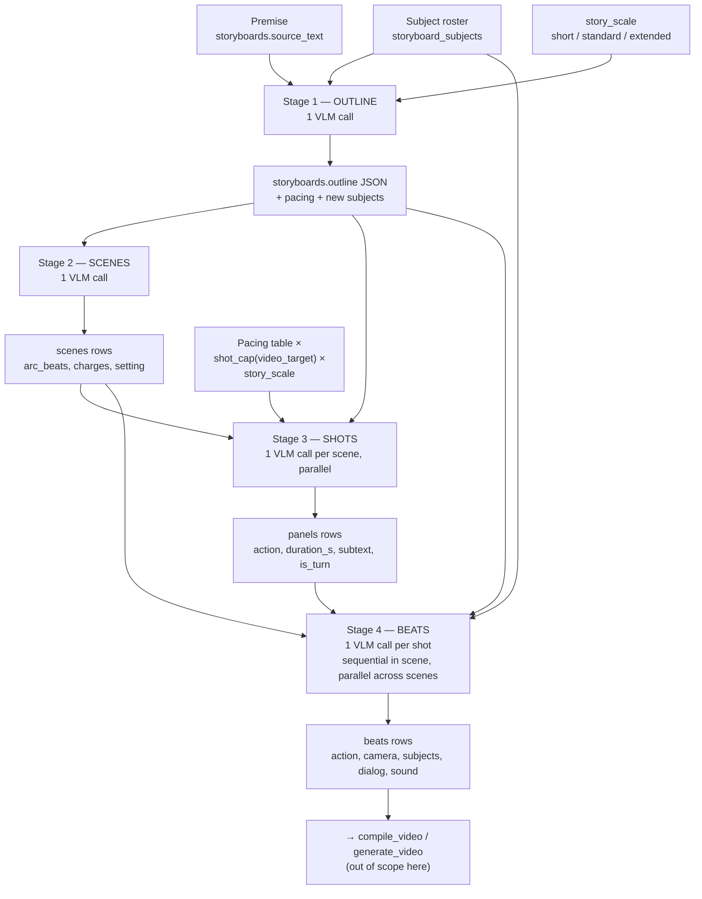

# The Storyboard Compose Pipeline

[← Back to README](../README.md)

How a one-paragraph premise becomes a fully specified tree of scenes, shots, and
beats. This documents the **compose** path only — everything that happens between
pressing **Compose** and having a storyboard tree ready for video-prompt
compilation. Downstream stages (H3 compile, video generation) are covered at the
end only as far as their inputs connect.

**Code map**

| Concern | Where |
|---|---|
| Stage orchestration, VLM calls, DB writes | `metascan/core/storyboard_runner.py` — `compose_story` → `_compose_locked` → `_run_stage` |
| Grammars, validators, lints, prompt builders (pure, no I/O) | `metascan/core/storyboard_story.py` |
| System prompts (hot-reloaded YAML) | `data/meta_prompt.yml` — `STORY_OUTLINE_SYSTEM`, `STORY_SCENES_SYSTEM`, `STORY_SHOTS_SYSTEM`, `STORY_BEATS_SYSTEM` |
| Shot-duration cap per video dialect | `metascan/core/video_targets.py` — `shot_cap()` |
| HTTP entry point | `POST /api/storyboard/{id}/compose` (`backend/api/storyboard.py`) |
| UI entry point | `OutlineDialog.vue` (the Compose dialog) |

## Pipeline at a glance

Each stage is one grammar-constrained VLM conversation per unit of work. The
stages are strictly ordered — every stage after outline refuses to run without
`storyboards.outline` — but the API takes any *subset* of
`("outline", "scenes", "shots", "beats")`, so you can rebuild just the shots of
one scene, or just the beats of three panels, without touching the rest.

---

## Entry point: the compose request

**Inputs**

| Element | Description |
|---|---|
| `stages` | Subset of `outline` / `scenes` / `shots` / `beats`. The Compose dialog's checkboxes; always run in canonical order regardless of request order. |
| `scene_ids` | Optional filter for the **shots** stage — rebuild shots for only these scenes. `null` = all scenes. |
| `panel_ids` | Optional filter for the **beats** stage — rebuild beats for only these shots. `null` = all shots. |
| `confirm` | The destructive-recompose acknowledgment. Doubles as the **purge** flag: a confirmed recompose deletes the destroyed subtree's generated media (files go to the OS trash), instead of releasing it into the library. |
| `storyboards.source_text` | The premise. The Compose dialog PATCHes any edit to it before composing. |
| `storyboards.story_scale` | `short` / `standard` / `extended`. Editable in the Compose dialog (commit-on-change PATCH), the create dialog, and Settings. |

**What happens.** The route calls `check_compose_gates` synchronously *before*
creating the 202 fire-and-forget task, so gate failures are real HTTP errors,
not WebSocket surprises:

- `outline` requested but `source_text` empty → 400 (no premise).
- `outline` requested and an outline already exists → 409 `confirm_required`.
- `scenes` requested and scenes exist → 409 (rebuilding destroys panel identity).
- `shots` requested and any target scene already has panels → 409.
- `beats` requested and any target panel's beats have generated images or a
  locked (hand-edited) prompt → 409.

The dialog answers a 409 with an inline warning banner; **Continue** re-posts
with `confirm=true`, which both bypasses the gate and arms the purge.

The whole run holds `StoryboardRunner._synth_lock` (mutually exclusive with
synthesis and with `generate()`'s VLM-unload path), ensures the VLM subprocess
is started, and sizes an `asyncio.Semaphore` from the active model's
`parallel_slots` so concurrent stage calls match `llama-server`'s `--parallel`.

**Output.** Per-stage `story_progress` (`{stage, done, total}`) and
`story_stage_complete` (`{stage, warnings}`) events on the `storyboard` WS
channel, then exactly one of `story_complete` (`{counts}`) or `story_error`
(`{stage, error}` — stamped with the stage that actually failed).

---

## Shared machinery (applies to every stage)

**Grammar-constrained generation.** Every call passes a GBNF grammar built in
`storyboard_story.py` from the enum constants, so the model *cannot* emit a
malformed shape or an out-of-vocabulary enum token. Grammars live in Python
(not YAML) because they're derived from the same constants the validators use.

**`generate_validated` — the retry ladder.** Each unit of work is:

1. One VLM call → run the stage's **validator**. A `StoryError` (unparseable /
   structurally empty response) gets exactly **one blind retry**.
2. If the stage has a **cinematic lint**, run it. Violations trigger exactly
   **one targeted re-roll**: the violation strings are appended verbatim to the
   user prompt ("Your previous response violated these rules — regenerate the
   full JSON, fixing each: …"). Small models correct well against specific
   complaints.
3. Whatever violations survive the re-roll are returned as **warnings** — style
   rules never hard-fail a stage. They surface in `story_stage_complete`.

**Truncation salvage.** Array-shaped responses parse through `_loads_array`:
if generation was cut off at `max_tokens` mid-element, it walks back to the
last complete element boundary and closes the array — recovering everything the
model finished rather than failing the stage.

**`story_scale`.** Three lengths, moving three things together (standard is
byte-identical to the pre-scale behavior):

| Knob | short | standard | extended |
|---|---|---|---|
| Arc entries (grammar cap) | 2–4 | 2–7 | 2–12 |
| Scenes (grammar cap) | 1–4 | 2–8 | 2–12 |
| Shots per scene (grammar cap) | 1–4 | 1–6 | 1–12 |
| Shot-count prompt factor | ×0.5 | ×1 | ×2 |
| max_tokens (outline / scenes / shots) | 2048 / 2048 / 1600 | same | 3072 / 4096 / 3200 |

The grammar caps are hard ceilings; the *explicit shot-count numbers in the
prompt* are what bind in practice (premise-level "make it long" requests never
beat them); the token budgets keep long output from being tail-truncated.
**Beats never scale** — they're bounded by the video clip cap, not story length.

**The pacing table.** `storyboards.pacing` (chosen by the outline stage, one of
`contemplative` / `standard` / `propulsive`) drives ASL-derived numbers for the
shots and beats prompts via `pacing_guidance`:

| pacing | shot duration | shots/scene (pre-scale) | beats/shot | beat ASL |
|---|---|---|---|---|
| contemplative | 10–15 s | 1–3 | 1–3 | ~7 s |
| standard | 8–15 s | 2–4 | 2–4 | ~4.5 s |
| propulsive | 6–12 s | 3–6 | 3–5 | ~2.5 s |

Shot duration is clamped to `shot_cap(video_target)` — 15 s for MiniMax H3 —
the one deliberate coupling between story composition and the video dialect:
compose must not write shots the compiler can't render as a single clip.

---

## Stage 1 — Outline

*One VLM call per storyboard. `temperature=0.7`, `timeout=600 s`.*

### Inputs

| Element | Description |
|---|---|
| `storyboards.source_text` | The premise, verbatim. Setting, named subjects, central action, and stated resolution are declared fixed; the model may invent only where the premise leaves gaps. |
| Subject roster | Existing `storyboard_subjects` rows as `- name: description` lines. The prompt orders names reused **verbatim**, never re-described — so user-authored subjects keep their identity. |
| `story_scale` | Sets the arc grammar cap, the token budget, and (short/extended only) an arc-length hint line — extended asks for six to ten arc entries, repeating `rising` between setup and resolution. |
| `STORY_OUTLINE_SYSTEM` | The "story architect" persona: design a 1–2-minute visual short. |
| `outline_grammar(scale)` | Forces the exact JSON object shape and the `pacing` / arc-stage enums. |

### What the stage does

A single call produces the story's skeleton: a logline, a tone, a **pacing**
choice (the register that later scales every shot and beat count), a duration
target, a **subject roster** (each a dense visual description — concrete nouns
and adjectives, never backstory — plus an optional voice description for
speakers), and the **arc**: an ordered list drawn from the fixed sequence
`setup → rising → turn → climax → resolution` (subset allowed, reordering not),
each entry paired with a one-to-two-sentence summary.

The validator requires logline, tone, and a non-empty arc; it defaults a
missing/invalid duration to 90 s and an invalid pacing to `standard`, and drops
malformed subjects/arc entries rather than failing. There is no lint at this
stage.

### Outputs

| Element | Description |
|---|---|
| `storyboards.outline` | The validated outline as a JSON blob — the **context document every later stage receives**. |
| `storyboards.pacing` | Copied out of the outline for direct DB access. |
| New `storyboard_subjects` rows | Any outline subject whose name isn't already in the roster (case-insensitive) is created with its description and voice. **Existing rows win** — the model never overwrites a user's subject description. |
| `counts.outline = 1` | |

---

## Stage 2 — Scenes

*One VLM call per storyboard. `temperature=0.7`, `timeout=300 s`.*

### Inputs

| Element | Description |
|---|---|
| `storyboards.outline` | The full outline JSON, verbatim in the user prompt. (Stages 2–4 all fail fast with "needs an outline first" if it's missing.) |
| Outline `arc` | Parsed separately to drive the charge lint. |
| `story_scale` | Scene-count grammar cap + token budget. |
| `STORY_SCENES_SYSTEM` | Persona: break the outline into scenes with no gaps in arc coverage. |
| `scenes_grammar(scale)` | Object shape, arc-stage enum, charge range `-5..5`. |

### What the stage does

One call emits the scene list. A scene is a single continuous location and
time — moving elsewhere or skipping forward starts a new scene. Each carries a
slate-label **name**, visual **setting** (what a camera would see), optional
`subtitle` / `location` / `time_of_day` / `mood` / `lighting` / `notes`
(genuinely-unknown fields stay null rather than guessed), and its dramatic
bookkeeping: **`arc_beats`** (which outline arc stages land inside it) and
**`charge_in` / `charge_out`** (the story's emotional value from the
protagonist's POV, −5..+5, as the scene opens and closes).

`lint_scene_charges` then enforces the dramatic geometry, with one targeted
re-roll:

- The scenes' `arc_beats`, concatenated in scene order, must equal the outline
  arc exactly — every arc entry in exactly one scene, in order, no gaps.
- The charge chain must be continuous (each scene's `charge_in` = previous
  scene's `charge_out`) and no scene may have missing charges.
- The scene containing `turn` must have the largest charge swing of any scene.
- The story must not end on the same charge polarity it opened on.

### Outputs

| Element | Description |
|---|---|
| New `scenes` rows | Via `replace_storyboard_scenes` — the **old scene tree is destroyed** (panels, beats, beat images cascade away). On a confirmed recompose the destroyed tree's generated media rows are purged and the files moved to the OS trash; unconfirmed (no gate fired) they're released back into the library. |
| `counts.scenes` | Number of scenes written. |
| Warnings | Any lint violations that survived the re-roll. |

---

## Stage 3 — Shots

*One VLM call per target scene, running in parallel across scenes (bounded by
the VLM's `parallel_slots`). `temperature=0.6`, `timeout=300 s`.*

### Inputs (per scene call)

| Element | Description |
|---|---|
| `storyboards.outline` | Full outline JSON for story context. |
| The scene row | Name, setting/location, mood, lighting, time_of_day, its `arc_beats`, and its charge_in/charge_out — all rendered into the prompt. |
| Neighbor scene names | Previous and next scene names (or "(story opening)" / "(story ending)") for continuity. |
| Subject roster | `- name: description` lines; the prompt orders exact-name reuse. |
| `pacing_guidance(pacing, shot_cap, scale)` | The explicit instruction "Produce between N and M shots, each lasting between X and Y seconds" — pacing row × scale factor, duration clamped to the video target's clip cap. This is the binding length control. |
| `is_turn_scene` | `"turn" ∈ scene.arc_beats`. Switches the turn directive: exactly one shot must set `is_turn=true` in the turn scene; every shot false otherwise. |
| `STORY_SHOTS_SYSTEM`, `shots_grammar(scale)` | Cinematographer persona; array-of-shots shape with the scale's per-scene cap. |

### What the stage does

The model breaks the scene into shots — each a single continuous camera setup
("one take"). Per shot: **`action`** (one or two sentences of what is *visibly*
happening, exact roster names, no internal narration), **`duration_s`**,
**`subtext`** (one sentence of what the shot *means but does not show* — must
differ from the action), and **`is_turn`**. Framing and who's on screen are
explicitly deferred to the beats stage.

`lint_shots` (one targeted re-roll): the turn scene must mark exactly one shot
`is_turn`; every shot needs a non-empty subtext that doesn't restate its
action. After validation the runner zeroes `is_turn` on every shot of
non-turn scenes regardless of what the model said.

### Outputs

| Element | Description |
|---|---|
| New `panels` rows | Via `replace_scene_panels` per scene — the scene's **old panels (and their beats, images, and clips) are destroyed**, with the same confirmed-purge / unconfirmed-release semantics as scenes. `duration_s` falls back to 12 s if missing/invalid. |
| `counts.shots` | Total panels created across target scenes. |
| Warnings | Surviving lint violations, accumulated across scenes. |

---

## Stage 4 — Beats

*One VLM call per target shot — **sequential within a scene** (each call sees
the previous shot's ending for continuity), parallel across scenes.
`temperature=0.6`, `max_tokens=1600`, `timeout=300 s`. Deliberately unscaled.*

### Inputs (per shot call)

| Element | Description |
|---|---|
| Outline logline + tone | Story-level context (not the full outline JSON). |
| Scene context | Name, setting, time_of_day, lighting, mood. |
| The panel | Its `action`, `subtext`, `duration_s` (the target the beats must sum to), and `is_turn` (adds the "reserve the tightest framing for the turn beat" directive). |
| Continuity state | For the scene's first shot: an "establish the space wide (WS/EWS)" directive. For later shots: the previous shot's `action` plus a framing summary of its last beat (`describe_beat_framing` — shot size, angle, lens, composition, light). Skipped panels (when `panel_ids` filters) still contribute their existing beats to this chain. The last two shot sizes also carry into the lint so "same size three beats running" is caught **across shot boundaries**. |
| Subject roster | Assigned per beat by exact name; also the lookup table for dialog speakers. |
| `pacing_guidance` | "Produce N to M beats of roughly K seconds each" — the pacing row's beat numbers, unscaled by story_scale. |
| `STORY_BEATS_SYSTEM`, `BEATS_GRAMMAR` | Director persona; the largest grammar — a 2–6-element array where every camera field is enum-locked. |

### What the stage does

Each shot is decomposed into beats — sequential moments inside one continuous
take, and (downstream) the film-shot unit: **one beat becomes one H3
`[Shot n]` section**. Per beat the model commits to:

- **`action`** — exactly one concrete visible event, plus **`reveals`** (what
  this beat shows that the previous didn't) and **`emotional_intent`** (visible
  physical evidence, never an emotion label).
- **Framing** — `shot_size` / `angle` / `lens` / `composition` /
  `light_quality`, each from a fixed vocabulary or null.
- **`subjects`** — roster names visibly in frame, most important first.
- **Camera** — `camera_motion` (20-value vocabulary) with `camera_amplitude` /
  `camera_speed` / `movement_motivation`; `is_cut` marks an internal setup
  change (never on beat 1).
- **Sound & dialog** — a diegetic `sound` phrase, and `dialog` lines each with
  speaker, voice/delivery, language, and the exact spoken text.

The validator maps subject names to `subject_ids` (unknown names dropped with a
warning, never invented ids), maps dialog speakers the same way, coerces any
out-of-enum camera value to null, and clears amplitude/speed/motivation when
motion is null or `static`. Then **`rescale_beat_durations`** proportionally
fits the beats' duration sum to the panel's `duration_s` whenever it's off by
more than ±25% — arithmetic is always code-side, never re-prompted.

`lint_beats` (one targeted re-roll): never the same `shot_size` three beats
running; a scene-opening shot's first beat must be WS/EWS; any non-static
motion needs a `movement_motivation`; every beat needs a non-empty `reveals`;
a turn shot's tightest framing must not land on beat 1.

### Outputs

| Element | Description |
|---|---|
| New `beats` rows | Via `replace_panel_beats` per shot — beat-scoped: the shot's old beats (and their generated images, on a confirmed purge) are destroyed, but the shot's `panel_videos` clips survive, which is the point of panel scoping. Dialog is stored as a JSON array column; `prompt_locked`/`prompt_source` start clear. |
| `counts.beats` | Total beats across target shots. |
| Warnings | Surviving lint violations, prefixed `panel <id>:`. |

---

## What consumes the finished tree

Compose ends with a fully specified tree; two separate pipelines read it:

- **`compile_video`** (H3 compiler): deterministic — the beat script *is* the
  shot script. Every beat renders verbatim as a `[Shot n]` section with its
  camera spec, dialog, and timestamps; subjects/pictures/audio get per-panel
  reference labels; the only VLM call per panel is the grammar-constrained
  sound section. Result → `panels.video_prompt`.
- **`generate_video`**: validates every panel (compiled prompt present,
  references/voices on disk, anchor prerequisites), then submits per-panel
  ComfyUI jobs; clips ingest as hidden `panel_videos` rows.

Which is why compose quality matters where it does: the outline's *pacing* and
the scale's *shot counts* determine clip count; the shots stage's *durations*
(capped at the dialect's 15 s) determine whether each shot fits one clip; and
the beats stage's camera/dialog fields flow into the video prompt **verbatim**,
with no later paraphrase step to clean them up.
